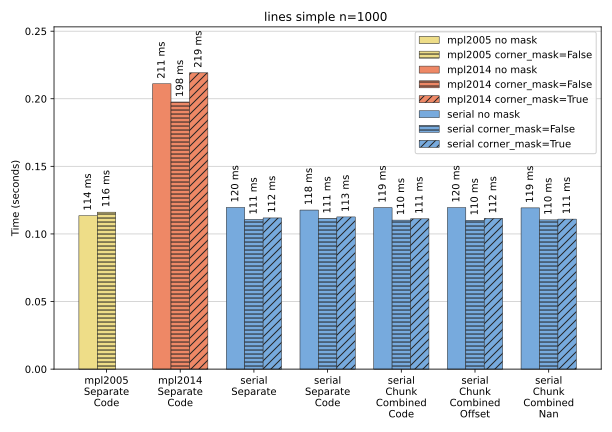
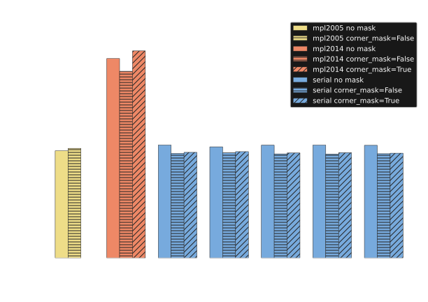
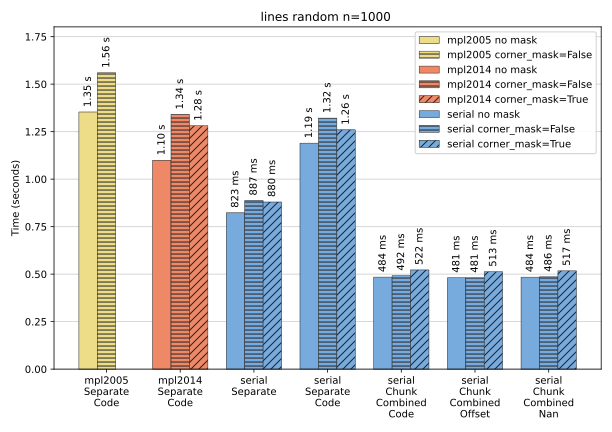
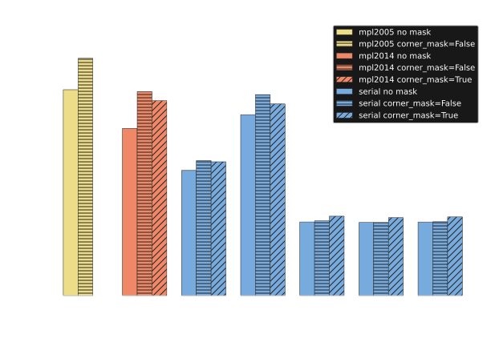
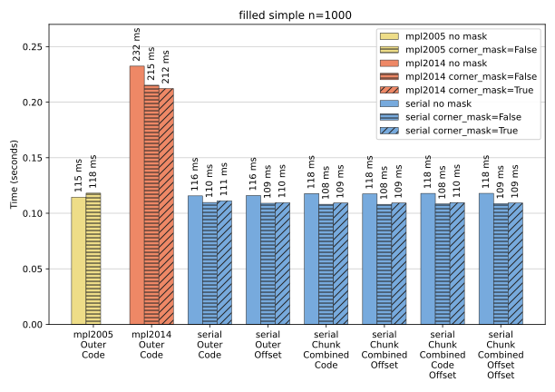
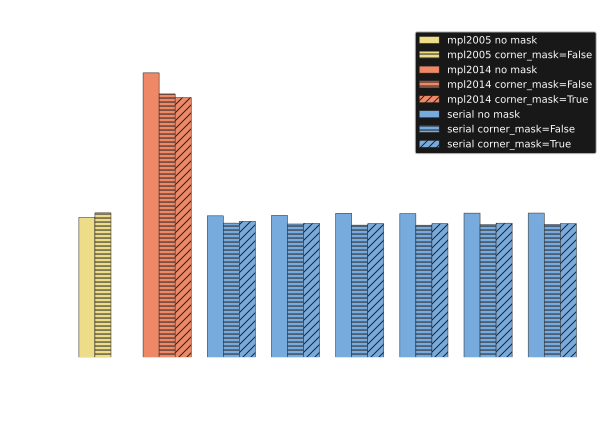
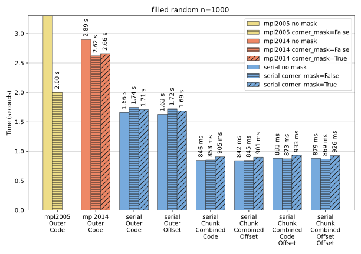
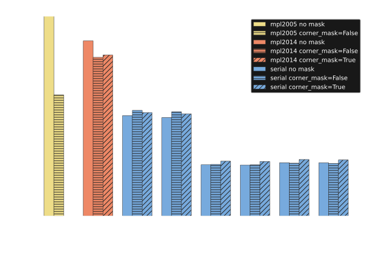

Calculation
-----------

There are two different datasets used for benchmarking obtained from the ``util`` functions
:func:`~contourpy.util.data.simple` and :func:`~contourpy.util.data.random`.  The former is the sum
of two gaussians that results in a small number of relatively short contours.  The latter is random
data that results in a large number of small contours and a few large contours; this is an extreme
dataset designed to stress the contouring algorithms. Both have the option to generate masked data.

All of the results shown are for a single chunk with a problem size ``n`` (``== nx == ny``) of 1000.

As a guide to the complexity of the output, the unmasked datasets generate the following line
contours in the benchmarks

- ``simple``: 38 lines of about 36 thousand points.
- ``random``: 850 thousand lines of about 7.4 million points.

and the following filled contours

- ``simple``: 55 boundaries (39 outers and 16 holes) of about 76 thousand points.
- ``random``: 1.7 million boundaries (half each of outers and holes) of about 15 million points.

Contour lines
^^^^^^^^^^^^^

For the ``simple`` dataset above the performance of ``serial`` for contour lines is the same
regardless of ``LineType``. It is about 20% slower than ``mpl2005`` and significantly faster than
``mpl2014`` with a speedup of 1.6-1.8.

For the ``random`` dataset above the performance of ``serial`` varies significantly by ``LineType``.
For ``LineType.SeparateCode`` ``serial`` is 10-20% faster than ``mpl2005`` and is slightly slower
than ``mpl2014``.

Other ``LineType`` are faster.  ``LineType.Separate`` has a speedup of about 1.4 compared to
``LineType.SeparateCode``; most of the difference here is the time taken to allocate the extra 850
thousand `NumPy`_ arrays (one per line) and a small amount is the time taken to calculate the
`Matplotlib`_ kind codes to put in them.

Both ``LineType.ChunkCombinedCode`` and ``LineType.ChunkCombinedOffset`` have similar timings with
a speedup of 2.3-2.6 compared to ``LineType.SeparateCode``.  The big difference here again is in
array allocation, for a single chunk these two ``LineType`` allocate just two large arrays whereas
``LineType.SeparateCode`` allocates 1.7 million `NumPy`_ arrays, i.e. two per each line returned.

Filled contours
^^^^^^^^^^^^^^^

For the ``simple`` dataset above the performance of ``serial`` for filled contours is the same
regardless of ``FillType``.  It it 15-25% faster than ``mpl2005`` and significantly
faster than ``mpl2014`` with a speedup of 1.7-1.9.

For the ``random`` dataset above the performance of ``serial`` varies significantly by ``FillType``.
For ``FillType.OuterCode`` it is faster than ``mpl2014`` with a speedup of 1.2-1.3.  It is also
faster than ``mpl2005`` but only the ``corner_mask=False`` option is shown in full as the unmasked
benchmark here is off the scale at 11.4 seconds.  The ``mpl2005`` algorithm calculates points for
outer and hole boundaries in an interleaved format which need to be reordered, and this approach
scales badly for a large outer boundary containing many holes as occurs here for unmasked ``z``.

Other ``FillType`` are faster, although ``FillType.OuterOffset`` is only marginally so as it
creates the same number of `NumPy`_ arrays as ``FillType.OuterCode`` but the arrays are shorter.

The other four ``FillType`` can be grouped in pairs: ``FillType.ChunkCombinedCodeOffset`` and
``FillType.ChunkCombinedOffsetOffset`` have a speedup of 1.8-2 compared to
``FillType.OuterCode``; whereas ``FillType.ChunkCombinedCode`` and
``FillType.ChunkCombinedOffset`` are marginally faster with a speedup of 1.9-2.1.  The speed
improvement has the usual explanation that they only allocate a small number of arrays whereas
``FillType.OuterCode`` allocates 1.7 million arrays.  ``FillType.ChunkCombinedCode`` and
``FillType.ChunkCombinedOffset`` are slightly faster than the other two because they do not
determine the relationships between outer boundaries and their holes, they treat all boundaries the
same.
