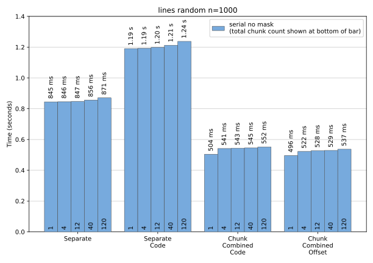

Calculation with chunks
-----------------------

This page shows the performance of the ``serial`` algorithm as the ``total_chunk_count`` is
increased from 1 to 120.

The performance of the  ``simple`` dataset varies by only a small amount (3.5%) for a
``total_chunk_count`` of up to 120.

For the ``random`` dataset the variations are greater at up to 14% and are usually, but not always,
slower for increasing ``total_chunk_count``.
