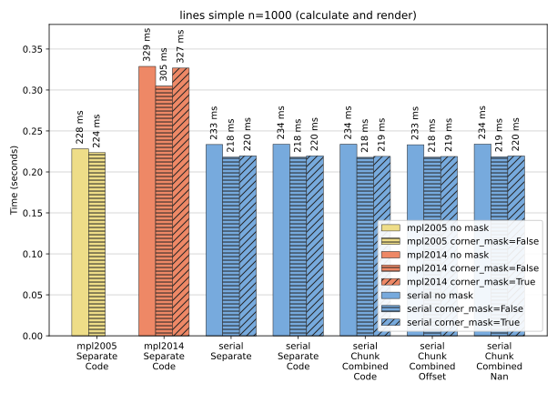
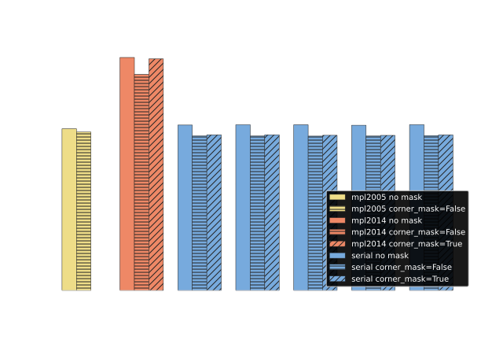
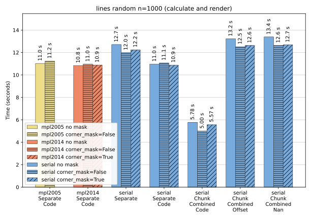
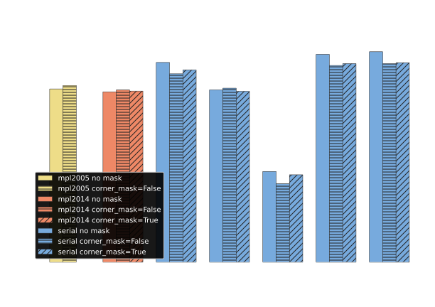
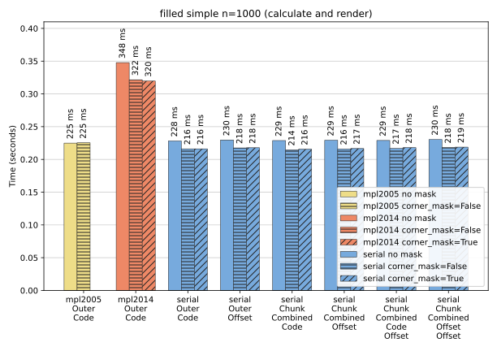
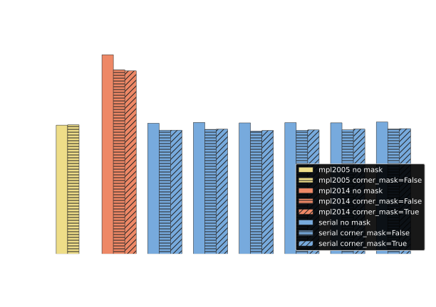
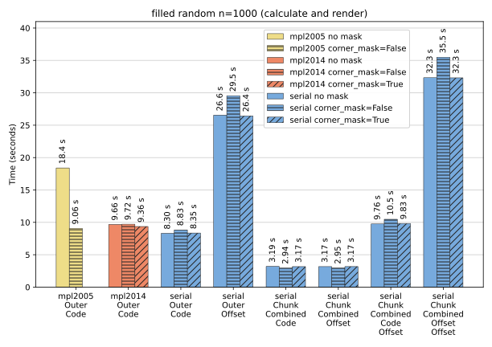
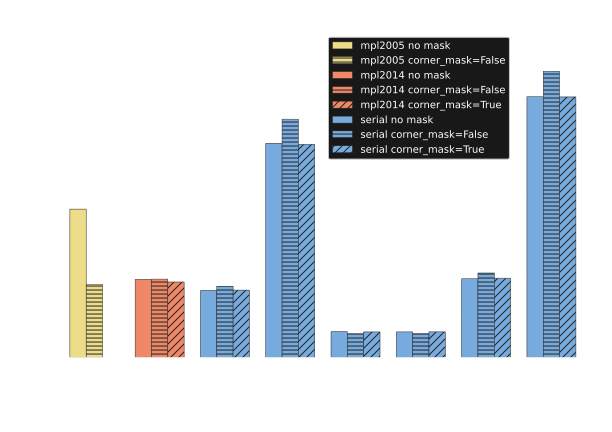

Calculation and rendering
-------------------------

This section considers the time taken to calculate contours and render them using `Matplotlib`_ on a
900x900 pixel canvas (using the Agg backend) and save them to PNG files.

Contour lines
^^^^^^^^^^^^^

For the ``simple`` dataset above the performance of ``serial`` for contour lines is the same
regardless of ``LineType``. It is slightly faster than ``mpl2005`` and significantly faster than
``mpl2014`` with a speedup of 1.3-1.4.  Comparing these times with the calculation-only times of
the previous section shows that the rendering time here is only about 125 ms so there is a fairly
even split between calculation and rendering time for ``serial``.

For the ``random`` dataset above the performance of ``serial`` varies significantly by ``LineType``.
For ``LineType.SeparateCode`` all three algorithms take about the same time.  The calculation time
for these is about 1.2 seconds, so here the rendering takes almost 90% of the total time.  This is
much more than for ``simple`` as the rendering is much more complicated.

The ``LineType`` that do not include `Matplotlib`_ kind codes are slower.  You must generate these
codes yourself or allow `Matplotlib`_ to generate them for you, either way is slower than asking
``contourpy`` to generate them for you in C++.

``LineType.ChunkCombinedCode`` is significantly faster than ``LineType.SeparateCode`` with a speedup
of 2-2.4.  This means that use of the ``serial`` algorithm with ``LineType.ChunkCombinedCode``
could halve the calculation and rendering time in `Matplotlib`_ for such complicated datasets.
The benefit here is in just having two `NumPy`_ arrays per chunk, one for points and one for codes,
which are ultimately used by `Matplotlib`_'s Agg renderer.  Compare this with
``LineType.SeparateCode`` which passes 850 thousand pairs of `NumPy`_ arrays that need to be
iterated over.

Filled contours
^^^^^^^^^^^^^^^

As usual, for the ``simple`` dataset above the performance of ``serial`` for filled contours is the
same regardless of ``FillType``.  It is slightly faster than ``mpl2005`` and significantly faster
than ``mpl2014`` with a speedup of 1.4-1.5.  As with ``lines`` the rendering time here is only
about 125 ms so there is a fairly even split between calculation and rendering time for ``serial``.

For the ``random`` dataset above the performance of ``serial`` varies significantly by ``FillType``.
For ``FillType.OuterCode`` it is faster than ``mpl2014`` by about 10-15%.  The calculation for
``serial`` here was about 1.8 s so the rendering takes about four times as long as the calculation.

Three of the other ``serial`` ``FillType`` take longer because they either have to create
`Matplotlib`_ kind codes anyway, in a less efficient way than allowing ``contourpy`` to do so in
C++, or in the case of ``FillType.ChunkCombinedCodeOffset`` by breaking up the large points and
codes arrays into many smaller arrays, one per polygon (outer plus holes).

``FillType.ChunkCombinedCode`` and ``FillType.ChunkCombinedOffset`` are significantly faster than
``FillType.OuterCode`` with a speedup of 2.7-3.1 compared to ``serial`` and 3-3.4 compared to
``mpl2014``.  Again this only has to send two `NumPy`_ arrays to `Matplotlib`_ for rendering rather
than 850 thousand pairs of them.

Care would be needed in switching to use ``FillType.ChunkCombinedCode`` in `Matplotlib`_.  Rendering
of filled polygons is much more computationally expensive than lines because with lines each is
independent and they can just be rendered in turn, whereas with polygons all of the boundaries need
to be processed at the same time so that each hole is associated with its corresponding outer
boundary.  With ``FillType.OuterCode`` each polygon (outer plus holes) is passed to the renderer
separately, so the renderers task is easy.  But with ``FillType.ChunkCombinedCode`` all of a chunk's
boundaries are passed together.  Typically such a renderer uses a sweep line algorithm which is
O(N log N) where N is the number of points, so the sweep lines would be faster overall if sent a
large number of small arrays rather than one, but this speed advantage is much less than the
disadvantage of having to create and manipulate a large number of `NumPy`_ arrays.

.. warning::

   Although ``FillType.ChunkCombinedCode`` is empirically a good choice for the Agg renderer it may
   not be so good for other backends.

If `Matplotlib`_ renderers could accept ``FillType.ChunkCombinedCodeOffset`` then we would have the
best of both worlds.  Only three arrays would need to passed per chunk, but the offsets could be
used to divide up the points and codes into individual polygons to be rendered separately.  If this
could be done without creating extra `NumPy`_ arrays, e.g. at the C++ level, this would be very
fast.

.. note::

   For these rendering benchmarks, ``FillType.ChunkCombinedCodeOffset`` is converted into the same
   form as ``FillType.OuterCode``, i.e. separate arrays for each outer boundary.  It could instead
   be converted into the same form as ``FillType.ChunkCombinedCode`` with all of each chunk's
   boundaries grouped together, and it would be much faster.  But if the outer offsets are going to
   be ignored then they may as well not be calculated so ``FillType.ChunkCombinedCode`` may as well
   be used instead.
