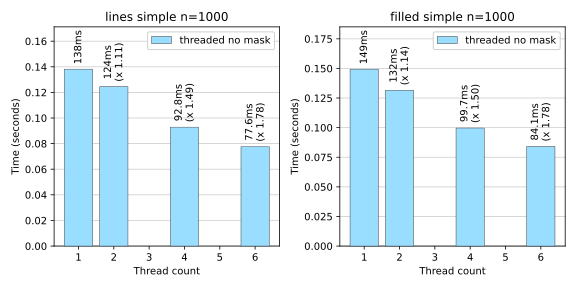
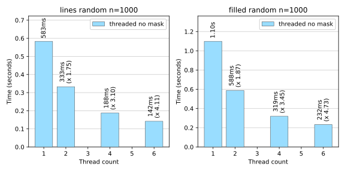

Multithreaded calculation
-------------------------

Benchmarks for the ``threaded`` algorithm are shown here, for unmasked ``z``, a
``total_chunk_count`` of 40, ``LineType.ChunkCombinedOffset`` and
``FillType.ChunkCombinedOffsetOffset`` on a 6-core processor.

For the ``simple`` dataset contour calculations are faster with more threads but only slightly.  The
speedup with 6 threads is only about 1.8 for both :func:`~contourpy.SerialContourGenerator.lines`
and :func:`~contourpy.SerialContourGenerator.filled`.  This problem dataset is not computationally
expensive enough to justify the use of multiple threads.

For the ``random`` dataset contour calculations scale much better with increasing number of threads.
Using 6 threads the speedup is between 4.1 for ``lines`` and 4.7 for ``filled``.

.. note::

   Whether it is worth using ``threaded`` rather than ``serial`` for a particular problem depends on
   the complexity of the dataset and what the calculated contours are to be used for.  If they are
   only needed for rendering using the `Matplotlib`_ Agg renderer, then for complicated problems the
   rendering time usually far exceeds the calculation time so a reduction in calculation time may
   not be of much real-world benefit.

.. warning::

   The threaded algorithm is work in progress and should be considered experimental.  It works fine
   in an isolated environment using the ``contourpy`` tests and benchmarks, but needs to be
   rigorously tested in real-world environments that that include mixed Python/C++ code and multiple
   threads before it can be considered production quality.
