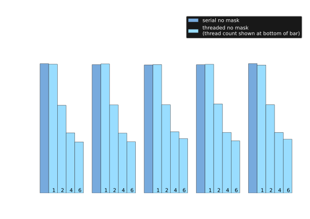
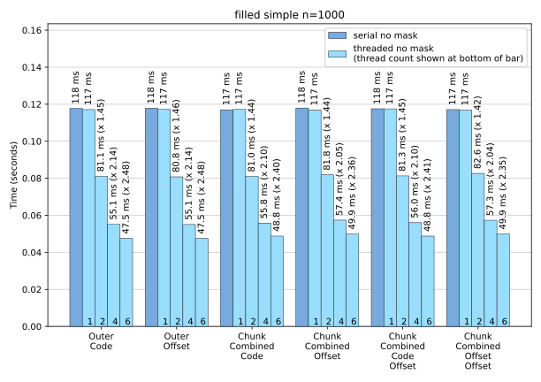
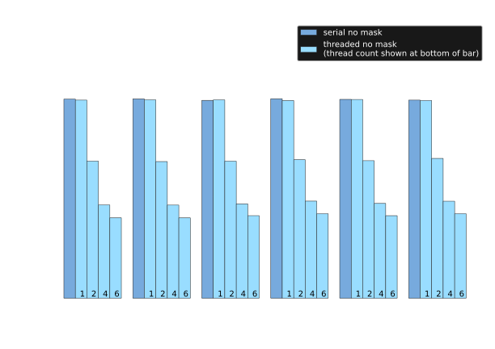
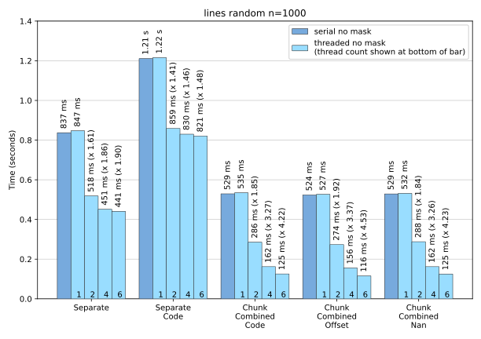
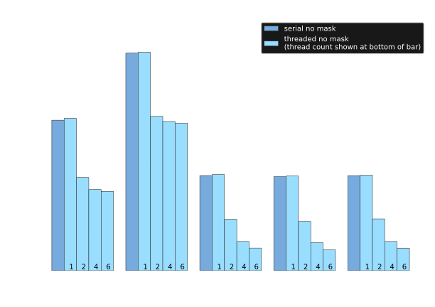
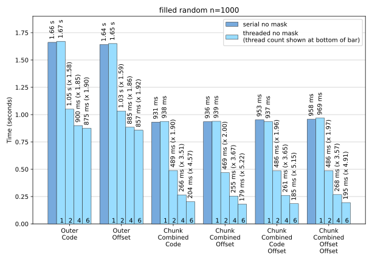
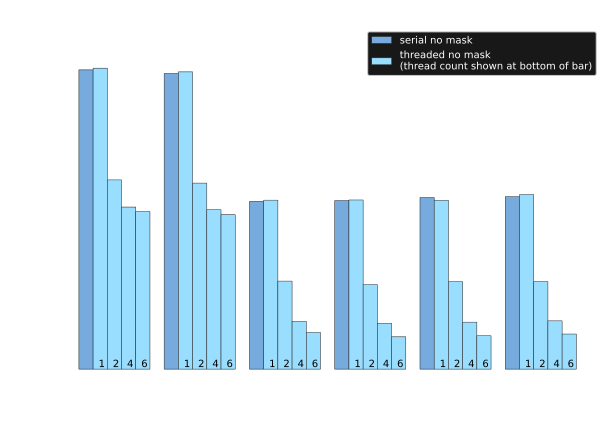

Multithreaded calculation
-------------------------

Benchmarks for the ``threaded`` algorithm are shown here, for unmasked ``z``, a problem size ``n``
of 1000 and a ``total_chunk_count`` of 40 for up to 6 threads.

.. image:: ../_static/threaded_lines_simple_light.svg
   :class: only-light

For the ``simple`` dataset contour calculations are faster with more threads but it does not scale
particularly well.  The speedup with 6 threads is about 2.6 for :func:`~contourpy.ContourGenerator.lines`
and about 2.5 for :func:`~contourpy.ContourGenerator.filled`.  This problem dataset is perhaps not
computationally expensive enough to justify the use of multiple threads.

For the ``random`` dataset contour calculations scale much better with increasing number of threads
as long as one of the ``ChunkCombined...`` line or fill types is being used.
Using 6 threads the speedup is about 4.4 for :func:`~contourpy.ContourGenerator.lines` and 5.1 for
:func:`~contourpy.ContourGenerator.filled`.

The ``LineType`` and ``FillType`` options that do not scale well are those that return individual
NumPy arrays for each line or polygon rather than combined arrays for each chunk. This is because
the allocation of a new NumPy array can only be performed by one thread at a time, so the larger the
number of arrays that are generated, the greater the likelihood that other threads are left waiting
before they can allocate arrays.

.. note::

   Whether it is worth using ``threaded`` rather than ``serial`` for a particular problem depends on
   the complexity of the dataset and what the calculated contours are to be used for.  If they are
   only needed for rendering using the `Matplotlib`_ Agg renderer, then for complicated problems the
   rendering time usually far exceeds the calculation time so a reduction in calculation time may
   not be of much real-world benefit.

.. warning::

   The threaded algorithm is work in progress and should be considered experimental.  It works fine
   in an isolated environment using the ``contourpy`` tests and benchmarks, but needs to be
   rigorously tested in real-world environments that that include mixed Python/C++ code and multiple
   threads before it can be considered production quality.
