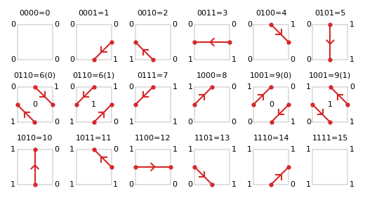
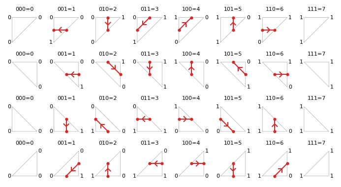
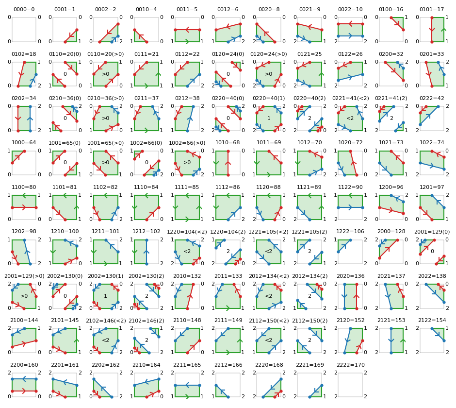
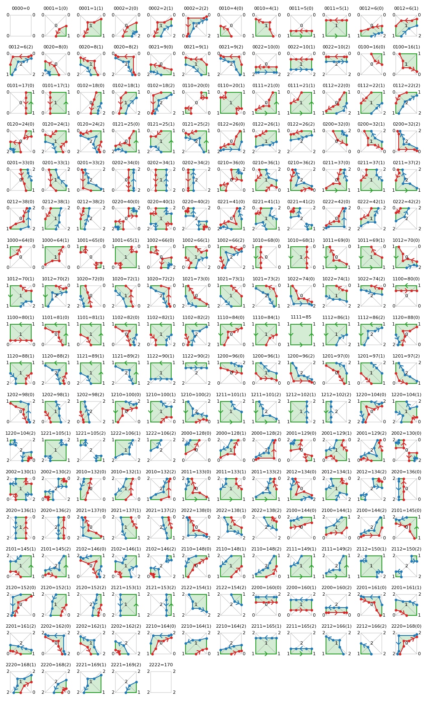

Configurations
==============

This page shows in graphical form all of the valid configurations of corner points being above or
below contour levels and their corresponding contour lines. These configurations are used in the
``serial`` and ``threaded`` algorithms, and also help to explain the contouring process.
The diagrams are generated by ``contourpy``'s test suite to show that the code correctly deals with
all configurations.

Contour lines
-------------

The notation used for quad configurations is of the form 1001=9(1). The first 4 bits are the
z-levels of each of the corners with 0 being below the contour level and 1 above. The order
of the corners using compass directions (which is what is used in the C++ source code) is
NW, NE, SW and SE. This is followed by an equals sign and the decimal equivalent of the 4-bit binary
number in the range 0 to 15 inclusive for quads.

This may be followed by another number in brackets, which represents whether the middle of the quad
is below or above the contour level. If ``quad_as_tri=False`` then this is only important for saddle
quads, i.e. configurations for which the contour line passes through all 4 sides of the quad.
For ``quad_as_tri=True`` it is important for nearly all configurations.

Note that the direction of contour lines is such that higher ``z`` is on the left.

Quad with ``quad_as_tri=False``
^^^^^^^^^^^^^^^^^^^^^^^^^^^^^^^

Quad with ``quad_as_tri=True``
^^^^^^^^^^^^^^^^^^^^^^^^^^^^^^

.. image:: ../tests/baseline_images/config_lines_quad_as_tri.png
   :class: only-light
   :target: _images/config_lines_quad_as_tri.png

Corner
^^^^^^

For lines in corners, only 3 corner points are relevant.

Filled contours
---------------

For filled contours each quad corner has a ``z`` level of either 0, 1 or 2.  0 corresponds to a
``z`` value below the lower contour level, 1 to a ``z`` value between the contour levels, and 2 to a
``z`` value above the upper contour level. These ternary (base-3) numbers are assumed to be
quarternary (base-4) numbers to calculate their decimal equivalent as base-4 arithmetic is much
easier to understand than base-3 for those familiar with binary.

Decimal configuration values go from 0 to 170 for quads, but not all values exist.

Note that direction of lines following the lower contour level is such that higher ``z`` is on the
left, the same as for contour lines, and that the direction of lines following the upper contour
level is such that higher ``z`` is on the right.

Quad with ``quad_as_tri=False``
^^^^^^^^^^^^^^^^^^^^^^^^^^^^^^^

Quad with ``quad_as_tri=True``
^^^^^^^^^^^^^^^^^^^^^^^^^^^^^^

Corner
^^^^^^

